### `AischoolProject2`

# Aischool page 만들기

### 1. Home

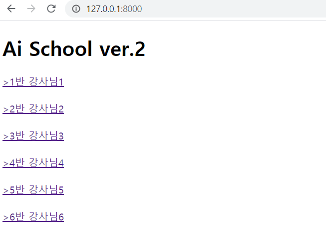

---

### 2. 1반 클릭 

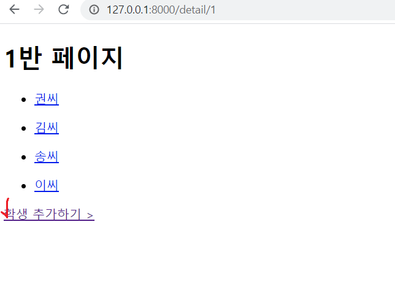

---

### 3. 학생 추가하기

- 학생 추가 페이지

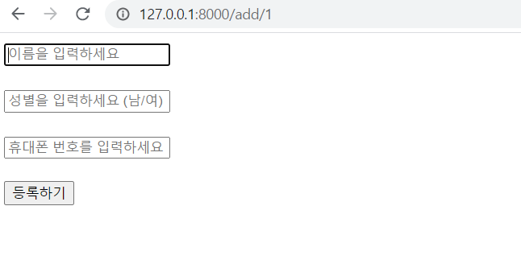

- 새로운 학생 정보 입력

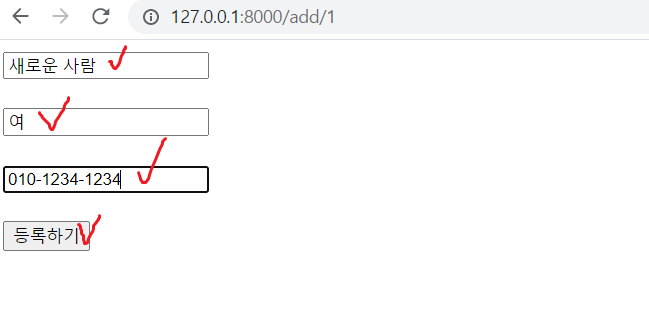

- 새로운 학생 등록 후

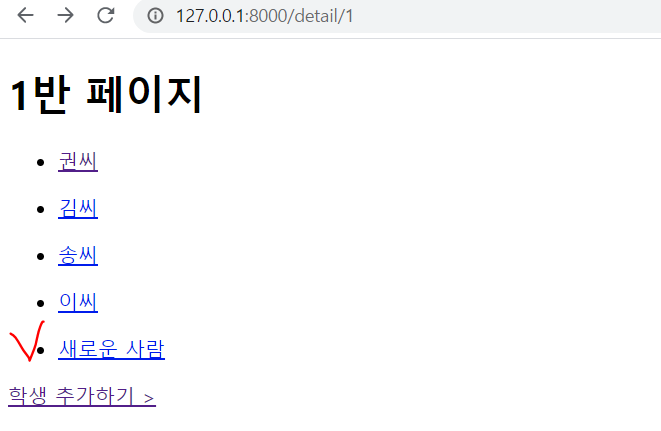

---

### 4. 학생 페이지 

- 기존 학생 페이지

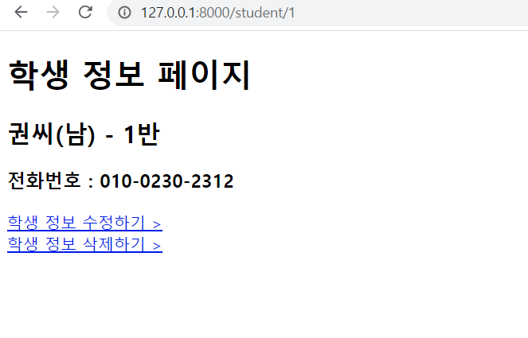

- 새로 추가한 학생 페이지

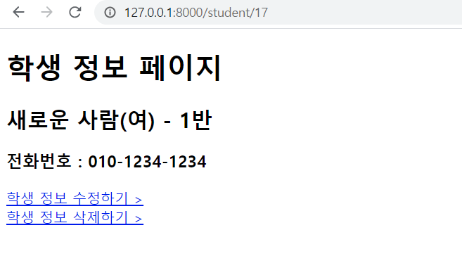

---

### 5. 학생 정보 수정하기

- 학생 정보 수정 페이지

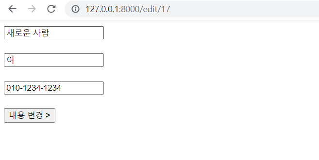

- 학생 정보 수정

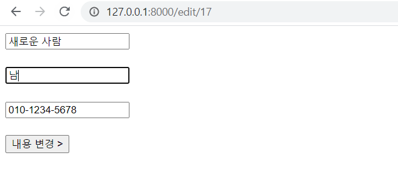

- 학생 정보 수정 후 변경된 정보 확인

---

### 6. 학생 정보 삭제하기

- 학생 정보 삭제하기 클릭

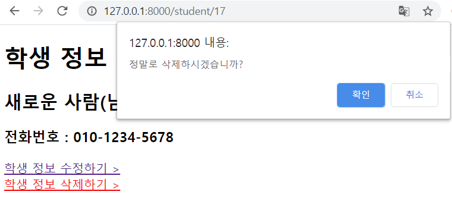

- 학생 정보 삭제 후 변경된 정보 확인

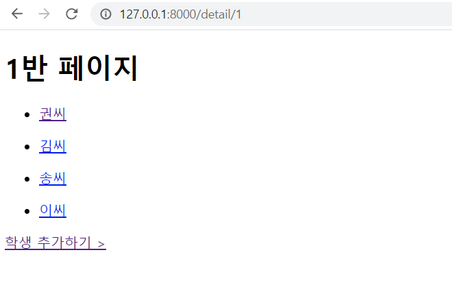